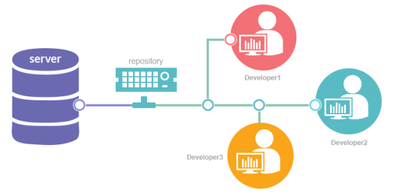

# Git, GitHub, y Control de Versiones
## Por: [Ivan Romero](https://portafolio-ivanromero03.vercel.app/)


---

# Control de Versiones
<div style="display: flex; height:min-screen;">

<ul>
    <li>Colaboración</li>
    <li>Versiones</li>
    <li>Accesibilidad</li>
</ul>
</div>

---

# Git
- Git es el sistema de control de versiones más usado del mundo.
- El pilar de el software libre y el código abierto en el mundo.
- Sistema de control de versiones distribuido.


---

# Control de Versiones Remoto



---

# GitHub
- GitHub es una plataforma de desarrollo colaborativo para alojar proyectos utilizando el sistema de control de versiones Git.
- Permite que se puedan colaborar en proyectos de software.
- La mayoría de los proyectos de software libre y código abierto se almacenan en GitHub.


---

# Cómo usamos Git


---

# Inizializar un repositorio
Inizialisamos un repositorio local
```bash
git init
```
O clonamos un repositorio remoto
```bash
git clone
```

---